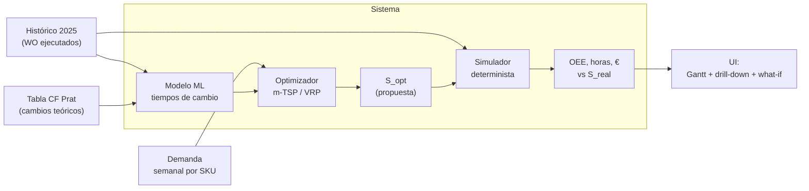
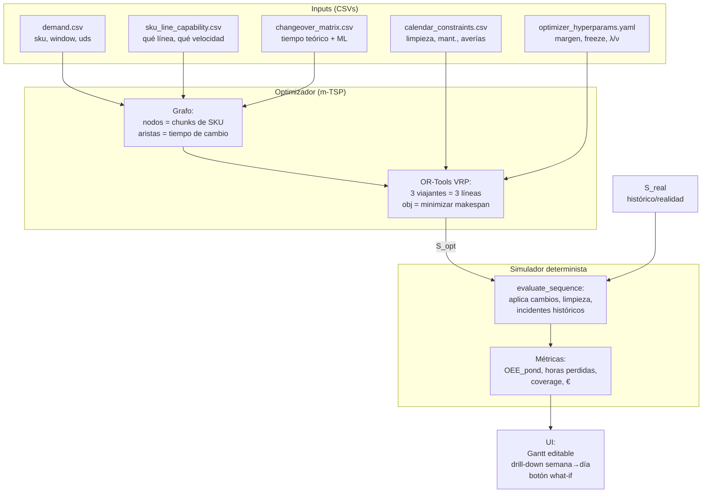
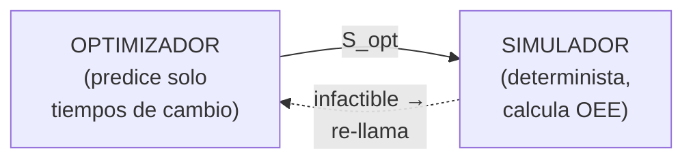
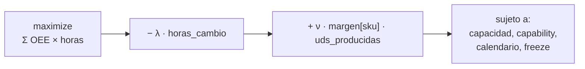
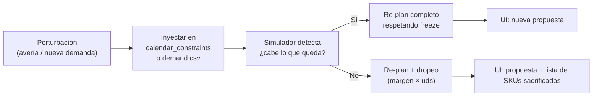
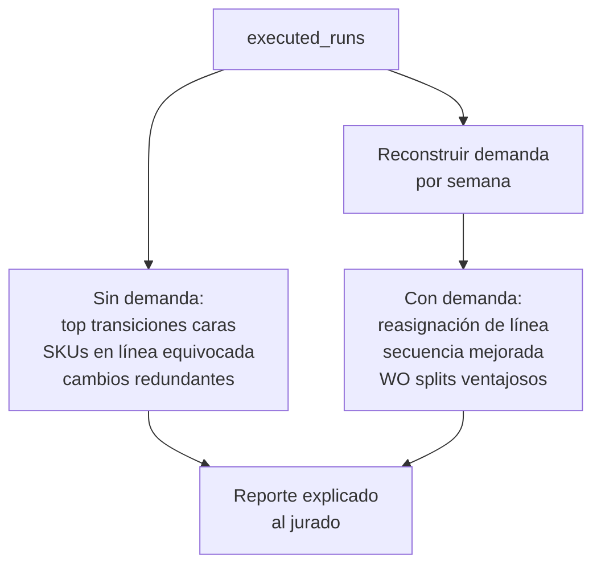
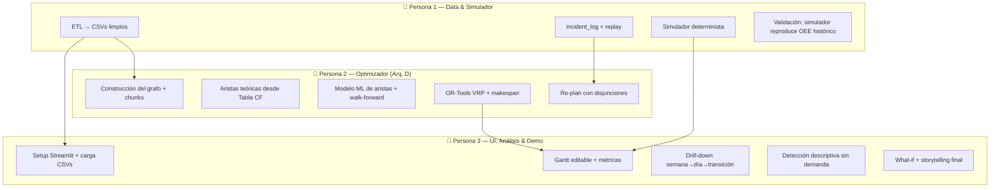
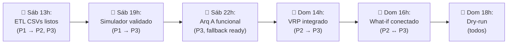

# LineWise — Resumen visual (Arquitectura D)

> Vista de pájaro de la solución. Para profundidad ver [`datos.md`](./datos.md), [`reto.md`](./reto.md), [`implementacion.md`](./implementacion.md) y [`cobertura_brief.md`](./cobertura_brief.md).

---

## 1. El reto en una mirada



**Idea**: el optimizador encuentra el "camino más corto" que cubre toda la demanda; el simulador calcula el OEE real de esa propuesta y la compara con lo que pasó.

---

## 2. Arquitectura D en una imagen



**Dos engines separados** (clave del diseño):



El optimizador no calcula OEE — lo predice **tiempo de cambio** y deja que el simulador haga el OEE post-hoc. Esto desacopla ML del KPI y hace la comparación con `S_real` perfectamente justa.

---

## 3. Función objetivo en una línea



**Dos regímenes implícitos** (sin código adicional):

| Régimen | Condición | Comportamiento |
|---|---|---|
| 🟢 Capacidad sobra | Toda la demanda cabe | Maximiza OEE, minimiza cambios |
| 🟠 Capacidad insuficiente | Avería o demanda urgente | Sacrifica SKUs de menor margen primero |

---

## 4. Datos en una tabla

| Fichero original | Rol | Estado |
|---|---|---|
| `OEE 14_17_19_ 2025.xlsx` | WOs ejecutados (espina dorsal) | ✅ Espina dorsal |
| `Tiempo 14_17_19_ 2025.xlsx` | Descomposición temporal | ✅ Para `incident_log` |
| `Volumen 14_17_19_ 2025.xlsx` | UDS/HL por WO | ✅ Junto con OEE |
| `Mantenimiento 14_17_19_ 2025.xlsx` | Averías históricas | ✅ Para `incident_log` |
| `Cambios 14_17_19_ 2025.xlsx` | Flags de cambio empíricos | ✅ Features del ML |
| `Tabla CF Prat 2026_14_17_19.xlsx` | Matriz teórica + calendario | ✅ Aristas teóricas |
| `Planificado - producciones….XLSX` | Plan teórico semana 18-24/05/2026 | ✅ Demo final |
| `Produccion_L14,17,19_18-22.xlsx` | Realidad esa semana | ✅ Demo final |
| `data - 2026-05-18….xlsx` | Duplicado de OEE | ❌ Descartado |
| `Diario Hl_Planif.xlsx` | Redundante e inconsistente | ❌ Descartado |

---

## 5. Flujos clave

### 5.1 Post-mortem (comparar real vs propuesta)

```mermaid
sequenceDiagram
    participant U as Usuario
    participant ETL
    participant Opt as Optimizador
    participant Sim as Simulador
    participant UI

    U->>UI: Elige semana W y ventana de comparación
    UI->>ETL: Reagregar executed_runs a demand.csv (semana W)
    ETL-->>Opt: demand.csv + inputs hermanos
    Opt->>Opt: Resuelve m-TSP con ML edges
    Opt-->>Sim: S_opt
    Sim->>Sim: Aplica replay incidentes W
    Sim-->>UI: Métricas S_opt
    Note over UI: Tiene también S_real con sus métricas reales
    UI->>U: ΔOEE, Δh_cambios, drill-down día→transición
```

### 5.2 Perturbación en marcha (avería o demanda urgente)



### 5.3 Detección de ineficiencias



---

## 6. Plan de implementación (3 personas, ~2 días)

### 6.1 Reparto por especialidad



### 6.2 Cronograma (Gantt)

```mermaid
gantt
    title Cronograma hackathon (2 días)
    dateFormat HH:mm
    axisFormat %H:%M

    section P1 Data+Sim
    ETL CSVs limpios          :p1a, 09:00, 4h
    Simulador base            :p1b, after p1a, 4h
    Incident log + replay     :p1c, 17:00, 3h
    Validación sim vs histor. :p1d, 09:00, 2h
    Soporte + tuning          :p1e, 11:00, 6h

    section P2 Optim
    Construcción grafo + chunks :p2a, after p1a, 3h
    Aristas teóricas (CF)       :p2b, after p2a, 2h
    ML de aristas + walk-forward:p2c, 18:00, 4h
    OR-Tools VRP integración    :p2d, 09:00, 5h
    Re-plan + disjunciones      :p2e, 14:00, 3h

    section P3 UI+Demo
    Setup Streamlit            :p3a, 09:00, 3h
    Greedy fallback (Arq. A)   :p3b, 12:00, 3h
    Gantt + métricas básicas   :p3c, 15:00, 4h
    Drill-down + ineficiencias :p3d, 09:00, 4h
    What-if + integración VRP  :p3e, 13:00, 3h
    Storytelling + dry-run     :p3f, 16:00, 2h
```

### 6.3 Detalle por persona

#### 👤 Persona 1 — Data & Simulador

| Día | Hora | Tarea | Output |
|---|---|---|---|
| Sáb | 09–13 | ETL pandas: join OEE+Tiempo+Volumen+Mantenimiento, drop columnas constantes, derivar `fecha_inicio`, calcular `speed_median`, parsear Tabla CF a `changeover_theoretical.csv` | 8 CSVs en `data/clean/` |
| Sáb | 13–17 | Simulador: función `evaluate_sequence(S, inputs) → dict de métricas`. Aplica cambios entre slots, eventos de calendario, overlay de incidentes | `simulator.py` con tests |
| Sáb | 17–20 | `incident_log.csv`: anclar incidentes a (tren, instante). Validar overlay sobre semana de muestra | `incident_log.csv` |
| Dom | 09–11 | Validación: aplicar simulador a `S_real` → debe reproducir OEE histórico con error < 5% | Notebook de validación |
| Dom | 11–17 | Soporte a P2 y P3 cuando integren con el simulador. Tuning de parámetros si hay sesgo. Optimizar tiempo de simulación si VRP necesita muchas llamadas | Velocidad <100 ms por evaluación |

#### 👤 Persona 2 — Optimizador (Arq. D)

| Día | Hora | Tarea | Output |
|---|---|---|---|
| Sáb | 13–16 | Construcción del grafo: leer `demand.csv`, partir SKUs grandes en chunks (max 8 h productivas), enumerar nodos factibles por línea, añadir nodos forzados de limpieza/mantenimiento | `graph_builder.py` |
| Sáb | 16–18 | Aristas teóricas: leer `changeover_theoretical.csv`, mapear pares de SKUs a tiempo de cambio según componentes (Envase, Marca, Packaging, etc.) | Matriz inicial de aristas |
| Sáb | 18–22 | Modelo ML de aristas: target = `changeover_time` empírico (de `PNP` previo a marcha). Features: SKU from/to + atributos + tren + hora + día. Gradient boosting + walk-forward. Capar predicciones con teórico como floor | `edge_model.pkl` + SHAP |
| Dom | 09–14 | OR-Tools VRP: 3 viajantes, capacidad temporal, disjunciones con penalty = `margen × uds`, objetivo makespan + ε·suma. Validar sobre semana de muestra | `optimizer.py` que devuelve `sequence.csv` |
| Dom | 14–17 | Re-plan: aceptar perturbación, identificar estado actual, aplicar freeze_days, re-correr | Endpoint `replan(perturbation)` |

#### 👤 Persona 3 — UI, Análisis & Demo

| Día | Hora | Tarea | Output |
|---|---|---|---|
| Sáb | 09–12 | Streamlit setup: cargar CSVs (mock primero), página de inicio con selector de semana | App skeleton |
| Sáb | 12–15 | **Fallback Arquitectura A** (greedy + reglas) end-to-end por si VRP no funciona el domingo. Demanda real → secuencia → simulador | Pipeline alternativo funcional |
| Sáb | 15–19 | Gantt por línea (plotly timeline) + métricas (OEE, h_cambios, coverage) en vivo. Conectar a simulator output | Gantt visible para una semana |
| Dom | 09–13 | Drill-down semana → día → transición: clic en peor delta abre detalle con flags de cambio activados y SHAP de aristas. Listado de "top 5 cambios ineficientes" sin necesidad de optimizador | Drill-down funcional |
| Dom | 13–16 | What-if: formulario para inyectar avería o demanda urgente. Conectar con endpoint de re-plan de P2. Mostrar diff antes/después | Botón "simular avería" funciona |
| Dom | 16–18 | Storytelling: README con narrativa de 5.1-5.5 de `implementacion.md`. Dry-run completo de la demo: plan 2026 → propuesta → drill-down → perturbación → recomendación final | Demo de 8 minutos cronometrada |

### 6.4 Sincronizaciones clave



---

## 7. Riesgos y mitigación

| Riesgo | Probabilidad | Mitigación |
|---|---|---|
| OR-Tools VRP no se integra a tiempo | 🟡 media | **Arq A ya está funcionando desde el sábado** como fallback presentable |
| Modelo ML de aristas tiene poca señal | 🟡 media | Aristas teóricas como floor; ML solo ajusta cuando tiene confianza |
| Simulador no reproduce OEE histórico | 🔴 baja-alta | P1 dedica el domingo AM a validación; ajustar fórmulas hasta error < 5% |
| Drill-down no se ve bien en demo | 🟡 media | Preparar 2-3 casos pre-cargados ("la peor transición de la semana 14") para no depender de búsqueda en vivo |
| Datos confidenciales en repo | 🔴 alta | `.gitignore` con `data/`, `data - original/`, `*.xlsx` **antes del primer commit** |
| Demo en vivo falla | 🟡 media | Tener video grabado de backup |

---

## 8. Lo que llevamos al jurado en 1 slide

> *"Optimizamos la secuencia de producción de las 3 líneas modelándolo como un problema de pathfinding: encontramos el camino más corto que cubre toda la demanda semanal. Un modelo de IA aprende del histórico los tiempos reales de cambio entre productos. Un simulador determinista valida la propuesta con los mismos incidentes que ocurrieron de verdad, así la comparación con el plan real es justa. Cuando hay una avería o un pedido urgente, replanificamos el resto de la semana priorizando los SKUs de mayor margen."*

Y la métrica de cabecera: **horas productivas ahorradas vs la semana real** — tangible, accionable, OEE-compatible.
